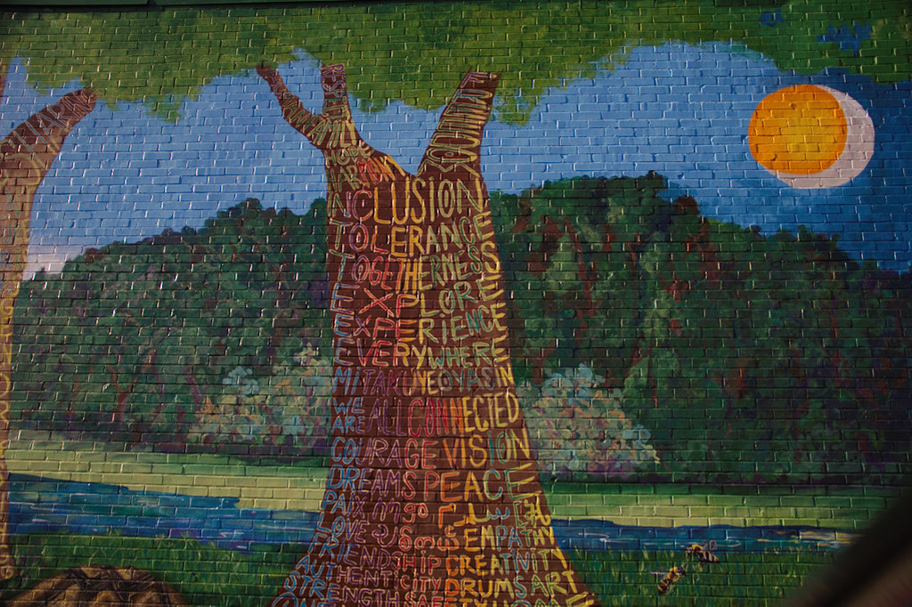

# Markdown Class Blog
## This is a Markdown Class and the beginning of a Blog

Week one was an introduction to Markdown. Every Week there is going to be a new link.

* For my Index Page Click [You are on My Index Page](./index.md)
* For Week1 Click [Week1 Class](./week1.md)
* For Week2 Cleck [Week2 Class](./week2.md) 
* For the [Next Class](./week3.md) and
* For the [Home page](./home.md) Coming Soon.

The above paint on the wall is a mural in downtown Clarkston, GA. The trucnk of the tree is covered with a very powerful words such us: Inclusive, togethernes, tolerance etc. I invite you to find more words.

This Beautiful breath-taking old building is located in San Antonio, TX.  It is the inside of one of the old settlement places called the Mission.

This amazing sunset is at Lake Lanier in Georgia, 2019.
